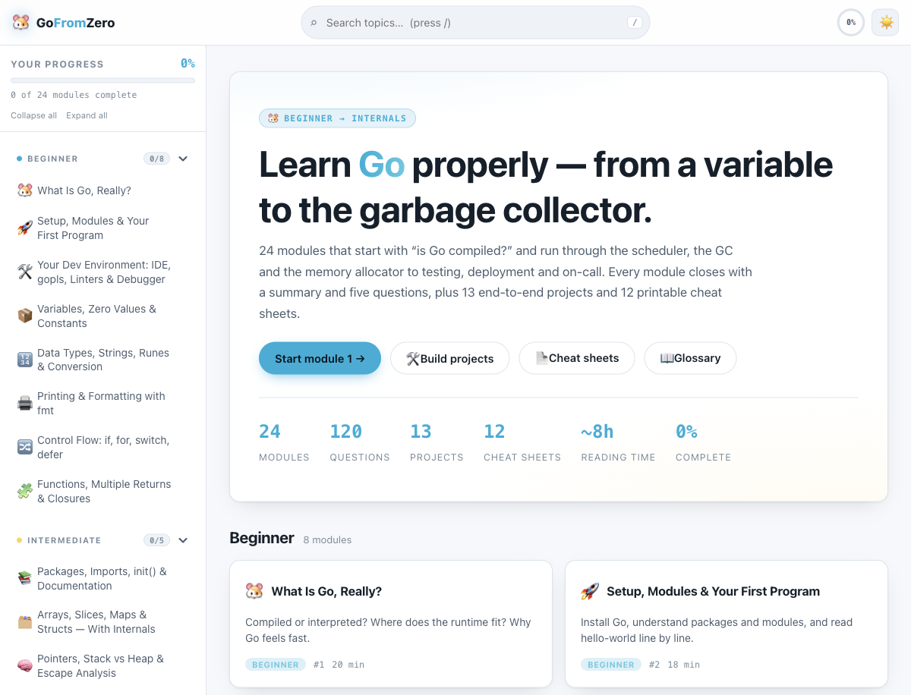

# Go From Zero 🐹

By **[Neha Sharma](https://x.com/hellonehha)** ([@hellonehha](https://x.com/hellonehha))

A responsive, interactive web app for learning Go — from "is Go compiled?" through variables and
data types all the way into the scheduler, the garbage collector and the memory allocator.

No build step, no dependencies, no network calls. Plain HTML, CSS and vanilla JavaScript.



## Run it

```bash
# simplest: just open the file
open index.html

# or serve it (recommended — avoids any file:// restrictions)
python3 -m http.server 8000
# then visit http://localhost:8000
```

## What's inside

**24 modules, 120 questions, 13 end-to-end projects, 12 cheat sheets, 18 animated diagrams, an 80-term glossary, 18 runnable programs, ~8 hours of reading.**

| # | Module | Level |
|---|--------|-------|
| 1 | What Is Go, Really? — compiled vs interpreted, the runtime, GC overview | Beginner |
| 2 | Setup, Modules & Your First Program | Beginner |
| 3 | Your Dev Environment: IDE, gopls, Linters & Debugger | Beginner |
| 4 | Variables, Zero Values & Constants | Beginner |
| 5 | Data Types, Strings, Runes & Conversion | Beginner |
| 6 | Printing & Formatting with fmt | Beginner |
| 7 | Control Flow: if, for, switch, defer | Beginner |
| 8 | Functions, Multiple Returns & Closures | Beginner |
| 9 | Packages, Imports, init() & Documentation | Intermediate |
| 10 | Arrays, Slices, Maps & Structs — with internals | Intermediate |
| 11 | Pointers, Stack vs Heap & Escape Analysis | Intermediate |
| 12 | Methods, Interfaces & Composition | Intermediate |
| 13 | Errors, Wrapping, Panic & Recover | Intermediate |
| 14 | Concurrency: Goroutines, Channels & Context | Advanced |
| 15 | Runtime Internals: Scheduler, GC & Allocator | Advanced |
| 16 | Generics & Type Parameters | Advanced |
| 17 | Iterators & range-over-func | Advanced |
| 18 | Testing, Benchmarking & Profiling | Advanced |
| 19 | The Standard Library: Build a Real HTTP Service | Advanced |
| 20 | Idiomatic Go, Performance & Where to Go Next | Advanced |
| 21 | Production Readiness: Config, Builds & Deployment | Production |
| 22 | Reliability & Observability | Production |
| 23 | Modules, Versioning & the Toolchain | Production |
| 24 | Security Essentials for Go Services | Production |

Every module ends with a **summary** and **five multiple-choice questions** with explanations.

Coverage is checked against [Effective Go](https://go.dev/doc/effective_go) and the
[Code Review Comments](https://go.dev/wiki/CodeReviewComments) wiki — including the parts tutorials
usually skip: `fmt` printing and `Stringer` (module 6), package initialisation order, `init()`, doc
comments and runnable examples (module 9), `new` vs `make` vs composite literals, 2-D slices, and
automatic semicolon insertion.

Module 3 is a full developer-environment setup (editor choice, gopls configuration, formatters,
which linters to enable and which to skip, Delve, code generators, Makefile and pre-commit hooks).
Module 18 covers testing in depth — table-driven tests, the test pyramid, fakes without a mocking
library, integration tests against real Postgres (testcontainers), end-to-end tests through
`httptest.NewServer`, fuzzing, benchmarks and pprof. Modules 21–24 cover production: config and
secrets, reproducible builds, distroless containers, migrations, CI gates, timeouts, retries with
jitter, circuit breakers, load shedding, logs/metrics/traces, health checks, graceful shutdown, Minimal
Version Selection and the full `go.mod` contract, and an application-security module (CSPRNG vs PRNG,
constant-time comparison, injection, traversal, SSRF, XSS, JWT pitfalls, DoS limits).

### Projects (`#/projects`)

Thirteen complete build guides across four tracks — each with target behaviour, architecture, the
code that matters, a tickable milestone plan (saved in `localStorage`), an honest definition of done,
the bugs you'll hit, and stretch goals. Work a track top to bottom; each project reuses the last
one's skills.

**CLI & Tools**

| Project | What it teaches | Level |
|---------|-----------------|-------|
| **gostat** — concurrent file-stats CLI | flags, io/fs, bufio, worker pool, golden-file tests, cross-compiled release | Starter |
| **crawlr** — concurrent web crawler | worker pools, context cancellation, rate limiting, dedupe, race-freedom, pprof | Intermediate |

**Web Apps**

| Project | What it teaches | Level |
|---------|-----------------|-------|
| **pulse** — real-time metrics dashboard | concurrent fan-in, circuit breakers, SSE, embedded templates, OpenTelemetry | Advanced |
| **inkwell** — server-rendered blog & CMS | html/template, sessions, CSRF, bcrypt, image uploads, HTMX, admin area | Intermediate |
| **chatter** — real-time chat | WebSockets, hub pattern, presence, heartbeats, reconnect, Redis pub/sub scaling | Advanced |
| **tilled** — storefront with checkout | integer money, order state machine, signed webhooks, idempotency, oversell prevention | Advanced |

**APIs & Services**

| Project | What it teaches | Level |
|---------|-----------------|-------|
| **snip** — URL shortener API | Postgres + migrations, middleware, SSRF validation, integration tests, metrics, Docker | Intermediate |
| **shelf** — production REST API | JWT + rotating refresh tokens, RBAC, keyset pagination, ETag/If-Match, idempotency, OpenAPI | Intermediate |
| **ledger** — gRPC service pair | protobuf contracts, buf breaking checks, streaming, interceptors, mTLS, grpc-gateway | Advanced |
| **dropbin** — file upload & sharing API | streaming multipart, TeeReader hashing, presigned URLs, Range requests, signed links | Advanced |
| **gateway** — API gateway & BFF | httputil.ReverseProxy, load balancing, caching + singleflight, canary splits, aggregation | Advanced |

**Systems & Data**

| Project | What it teaches | Level |
|---------|-----------------|-------|
| **tinykv** — persistent key-value store | append-only log, CRC records, crash recovery, compaction, fuzzing, benchmarks | Advanced |
| **jobq** — background job queue | SKIP LOCKED claiming, retries with backoff, idempotency, dead-letter, chaos testing | Advanced |

### Cheat sheets (`#/sheets`)

**IDE, linters & dev tooling** (copy-paste `settings.json`, `.golangci.yml`, `launch.json`, Makefile,
pre-commit) · Go CLI & toolchain · Syntax quick reference · Slices, maps & strings ·
Concurrency patterns · Runtime, GC & memory · Standard library essentials · Testing & debugging ·
Web & API patterns · Version timeline & modern idioms · Production readiness checklist ·
Gotchas & review checklist.

Each sheet downloads as a **real PDF** (A4, monospaced, page-numbered, generated in the browser by a
small built-in PDF writer — no library, no server), or as `.txt` / `.md`, and can be copied to the
clipboard or previewed inline. "All sheets as one PDF" produces a single bundle with a contents page
and one sheet per page break; "Print sheets" opens a clean print view containing only the sheets.

## Site pages

| Route | Page |
|-------|------|
| `#/` | Home — all modules and projects |
| `#/m/<id>` | A module |
| `#/p/<id>` | A project build guide |
| `#/projects` | Project overview, grouped into four tracks |
| `#/sheets` | Cheat sheets, with PDF / txt / md downloads |
| `#/glossary` | Searchable A–Z of all 80 terms |
| `#/playground` | Index of every runnable program *(behind the `playground` feature flag — off by default)* |
| `#/how-to-use` | The intended path, every feature, suggested schedules |
| `#/about` | What this is, what it isn't, accuracy, credits, the author |
| `#/privacy` | Privacy policy, data stored, copyright and licence terms |

Every page ends with a site footer carrying those links, the copyright line and a one-line privacy
summary.

## Features

- **Animated SVG diagrams** — 18 figures: the compile pipeline, compiled vs interpreted vs JIT,
  variables and zero values, bytes vs runes, the slice header and `append` reallocation, stack vs heap,
  interface values, `if`/`for`/`switch`, the defer stack, multiple returns, closures, channel
  rendezvous, `select`, worker pools, the G-M-P scheduler, tri-colour GC, the middleware chain, and the
  module-or-file decision. Each has **⏸ pause** (remembered across pages) and **↻ replay**; motion is
  always meaningful — marching-ant flow, sequential stage highlighting, labelled request tokens — and
  every figure reads fine with animation disabled
- **Glossary tooltips** — 80 terms (JIT, bytecode, VM, write barrier, escape analysis, MVS…) are
  auto-linked the first time they appear in prose. Hover or focus shows a popover on desktop; on mobile
  (≤820px) a tap opens a bottom sheet. "See also" chips jump between related terms, and `#/glossary`
  is a searchable A–Z reference
- **Feature flags** (`resources/data/flags.js`) — flip a boolean and reload; anything gated disappears
  completely: its nav entry, buttons, route, footer link, and the sentences in About / How to use /
  Privacy that describe it. Override per session with `?ff=playground` / `?ff=-playground`.
  Content gates a whole block with `{ flag: "name" }`, or one list item / table row by prefixing it
  with `{{name}}`.
- **▶ Run in the Go Playground** *(flag `playground`, **currently off**)* — 18 complete, vet-clean programs (zero values, bytes vs runes, fmt
  verbs, the defer stack, closures, slice aliasing, receivers, the typed-nil trap, error wrapping,
  WaitGroup, `select`, worker pools, generics, iterators…). Run copies the program and opens
  [go.dev/play](https://go.dev/play/); `#/playground` indexes all of them. Fragments that would not
  compile deliberately get **no** Run button. Execution happens on Google's servers — compiling Go
  needs a Go toolchain, and this site is static files with no backend
- **Progress tracking** — completing a module's quiz ticks it off, and project milestones are
  individually tickable; all stored in `localStorage`
- **Interactive quizzes** — instant right/wrong feedback, an explanation for every answer, and
  option order randomised on each render so position carries no signal
- **Full-text search** — press <kbd>/</kbd>. It indexes every word of all 24 modules, 13 projects,
  12 cheat sheets, 80 glossary terms and 3 pages (132 documents): prose, code blocks, tables, notes,
  summaries, quiz text, milestones. Results are grouped by kind, ranked, and show a highlighted snippet;
  the sidebar filters to matching sections instead of going blank. Searches are shareable as `?q=printf`
- **Syntax highlighting** — a small purpose-built Go highlighter; every code block has a Copy button
- **Keyboard navigation** — <kbd>←</kbd>/<kbd>→</kbd> move between modules, <kbd>Esc</kbd> closes things
- **Dark / light themes**, following your system preference on first visit
- **Responsive** — sidebar becomes a drawer under 820px; print stylesheet included
- **Accessible** — skip link, focus-visible outlines, ARIA labels, honours `prefers-reduced-motion`

## File layout

```
index.html                              shell: topbar, sidebar, main
resources/styles.css                    theming, layout, print styles
resources/app.js                        router, renderers, quiz logic, highlighter, downloads
resources/data/content-1-foundations.js modules 1–5
resources/data/content-2-core.js        modules 6–10
resources/data/content-3-advanced.js    modules 11–13
resources/data/content-4-practice.js    modules 14–16
resources/data/content-5-production.js  modules 17–18
resources/data/projects.js              build guides: CLI, systems, first API/web
resources/data/projects-2.js            build guides: web apps, APIs & services
resources/data/sheets.js                cheat sheet text
resources/data/diagrams.js              animated SVG figures (keyed by id)
resources/data/glossary.js              glossary terms, definitions and cross-links
resources/data/runnable.js              complete programs for the Run button, keyed "<module>|<title>"
resources/data/pages.js                 About / How to use / Privacy & copyright
resources/data/flags.js                 feature flags (playground: false)
```

## Adding or editing content

Each module is one object in a `resources/data/content-*.js` array:

```js
{
  id: "my-topic",            // used in the URL: #/m/my-topic
  level: "Beginner",         // Beginner | Intermediate | Advanced | Production
  icon: "🧩", title: "…", minutes: 15, blurb: "one line for the card",
  blocks: [
    { t: "h", text: "A subheading" },
    { t: "p", html: "Prose, may contain <code>inline HTML</code>." },
    { t: "code", title: "main.go", code: "func main() {}" },
    { t: "note", kind: "tip|warn|deep", title: "…", html: "…" },
    { t: "list", ordered: false, items: ["…"] },
    { t: "table", head: ["A","B"], rows: [["1","2"]] },
    { t: "diagram", id: "pipeline" }       // key from resources/data/diagrams.js
  ],
  summary: ["…"],            // bullet points; `backticks` and **bold** work
  quiz: [{ q: "…", options: ["…","…","…","…"], answer: 0, explain: "…" }]
}
```

A project (in `resources/data/projects.js` or `resources/data/projects-2.js`) follows the same `blocks` format, plus
`category` (the track it appears under — add a new one and the nav, home page and overview pick it
up automatically), `milestones`, `done`, `stretch`, `stack`, `level`, `time`, and `covers` (module
ids it applies, rendered as links).

Order within the file is the order in the sidebar and the prev/next pager. Nothing else to update —
the nav, home page cards, progress ring and stats all derive from the data.

## Licence & credits

© 2026 Neha Sharma. Course text, structure, diagrams and quizzes are her original work, all rights
reserved. **The Go code samples are free to use** in your own projects with no attribution required.
Republishing the written material (mirrors, translations, paid courses, video adaptations) needs
permission — see `#/privacy`. Go, the Go logo and the Playground belong to the Go Authors and Google;
the gopher was designed by Renée French. This is an independent educational project with no
affiliation to Google or any company named in it.

Content targets **Go 1.25** and names the release behind every modern feature, so it is useful whatever
version you are pinned to: generics (1.18), `GOMEMLIMIT` + typed atomics (1.19), `errors.Join` (1.20),
PGO + `slog`/`slices`/`maps`/`cmp` + `sync.OnceValue` (1.21), per-iteration loop variables + method
routing + `math/rand/v2` (1.22), range-over-func iterators + timer overhaul (1.23), Swiss-table maps +
`b.Loop` + `os.Root` + `omitzero` + tool directives (1.24), `WaitGroup.Go` + stable `testing/synctest` +
container-aware GOMAXPROCS (1.25). The **Version Timeline** cheat sheet carries an
old-pattern → modern-pattern table for exactly this.
